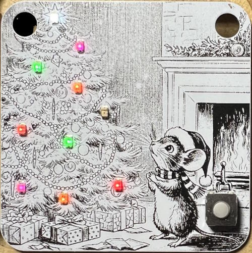
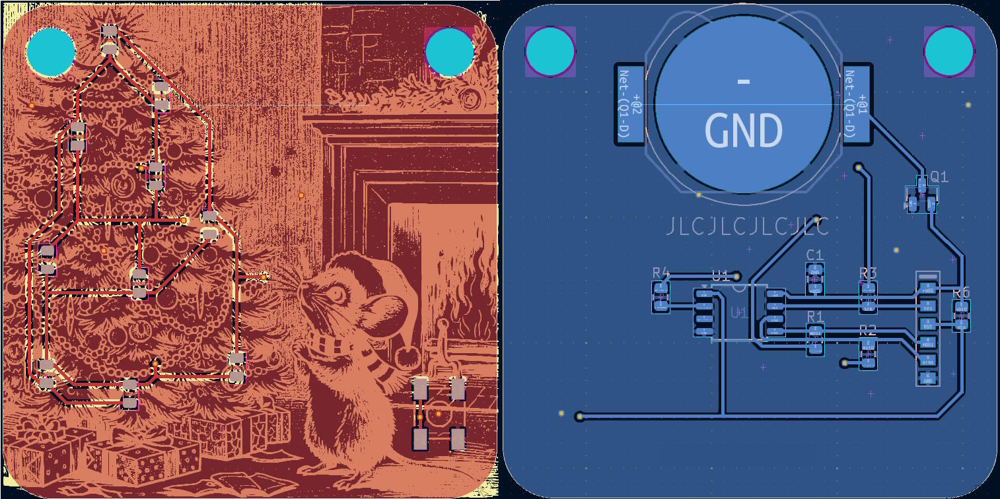
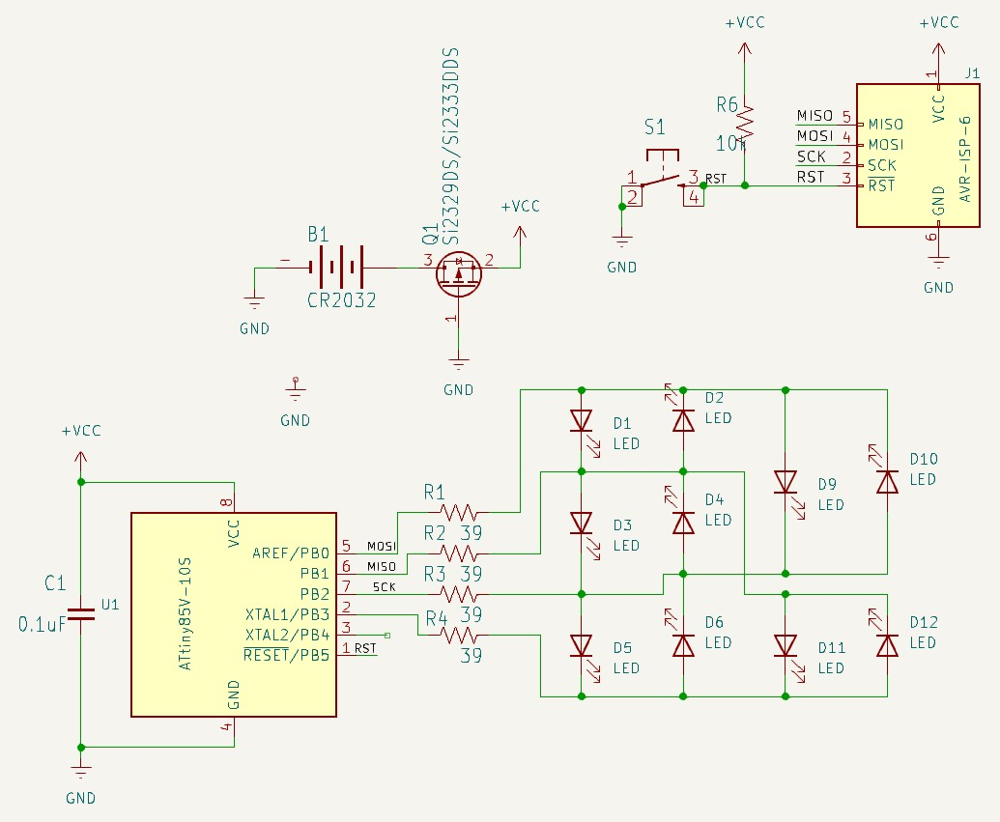

Christmas ornament number 13...

***

The detailed explanation of the original Snowman ornament is [here](https://github.com/ChristmasOrnaments/2013-Snowman).

This ornament shares the same schematic and code base as the previous ornaments. Obviously the silkscreen image and LED locations have changed. I have now moved to Kicad 9, as Eagle is no longer supported on Linux.

### Compiling

* Install [ATTinyCore](https://github.com/spencekonde/attinycore) using the boards manager
* Select **Attiny25/45/85 (No bootloader)** from the boards list
* Set the *Clock source* to **8MHz (internal)** (Code uses a prescalar of 2 to lower it to 4MHz)
* Set *B.O.D* to **Disabled**
* Select **Burn Bootloader** to write the changes
* Compile and write the program to the MCU

If using another method to program the MCU, just remember you need to set the fuses properly both for correct speed and for the power saving features. The fuses (for an ATTINY85) should be:

Low: 62  
High: DF  
Extended: FF

You can see the effect of different fuse settings (and their values) [here](http://www.engbedded.com/fusecalc/).

### Resources

**Charlieplexing Code using a byte array:**  
[https://www.instructables.com/CharliePlexed-LED-string-for-the-Arduino/](https://www.instructables.com/CharliePlexed-LED-string-for-the-Arduino/)

**Battery calculator:**  
[http://oregonembedded.com/batterycalc.htm](http://oregonembedded.com/batterycalc.htm)

**Power saving information:**  
[http://www.gammon.com.au/forum/?id=11497](http://www.gammon.com.au/forum/?id=11497)  
[http://www.insidegadgets.com/2011/02/05/reduce-attiny-power-consumption-by-sleeping-with-the-watchdog-timer](http://www.insidegadgets.com/2011/02/05/reduce-attiny-power-consumption-by-sleeping-with-the-watchdog-timer/)  
[http://www.nongnu.org/avr-libc/user-manual/group\_\_avr\_\_power.html](http://www.nongnu.org/avr-libc/user-manual/group__avr__power.html)e settings (and their values) [here](http://www.engbedded.com/fusecalc/).
